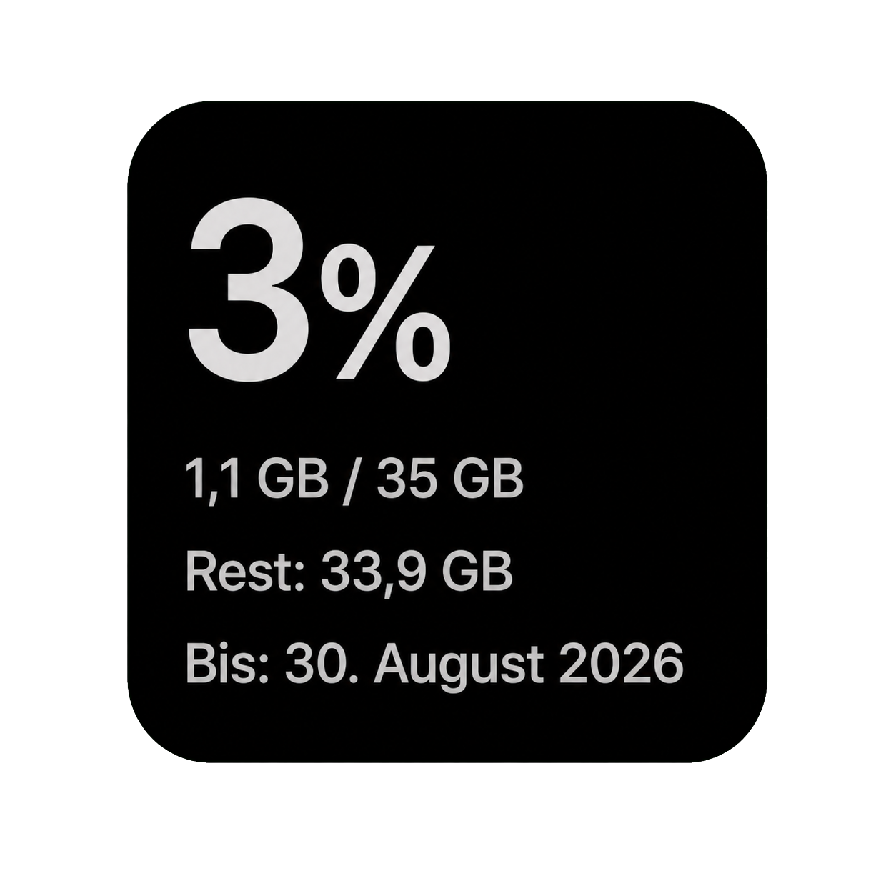
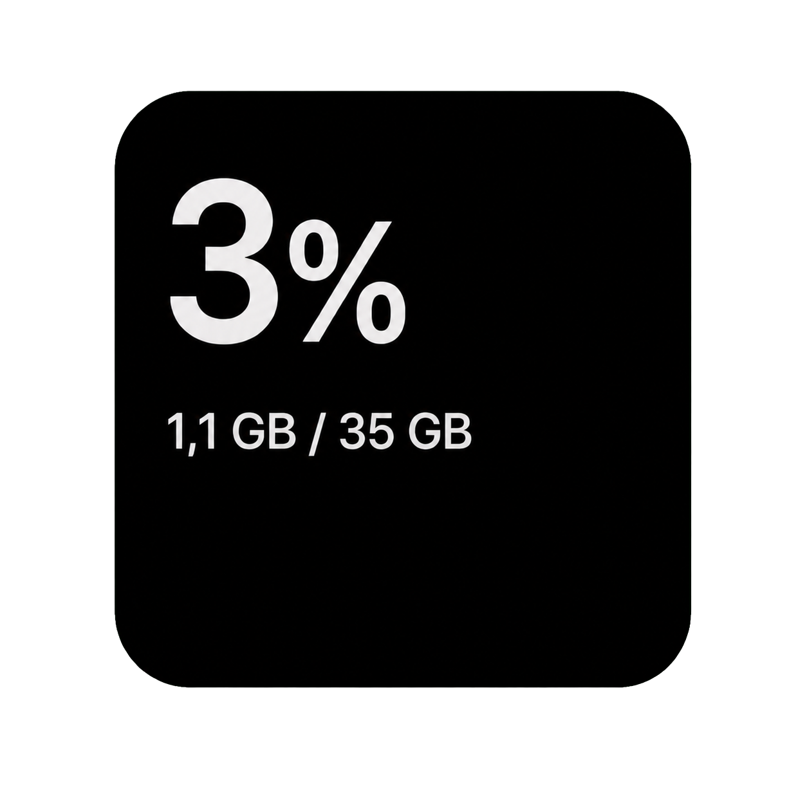

# Scriptable Telekom Data Widget

Ein kleines iOS-Widget für [Scriptable](https://scriptable.app/), das den Datenverbrauch einer Telekom-/Congstar-Mobilfunkverbindung anzeigt.

Das Script ruft `https://pass.telekom.de/home` als HTML ab und liest daraus Gesamtvolumen, Restvolumen und Gültigkeitsdatum. CSS, Bilder und JavaScript der Webseite werden dabei nicht zusätzlich geladen.

## Varianten

- [`telekom-data-widget.js`](telekom-data-widget.js) zeigt Prozentwert, Verbrauch, Gesamtvolumen, Restvolumen und Gültigkeitsdatum.
- [`telekom-data-widget-kompakt.js`](telekom-data-widget-kompakt.js) zeigt nur den Prozentwert und `verbraucht / gesamt`. Die Zeilen „Rest“ und „Bis“ werden nicht angezeigt.

## Screenshots

Beispielansichten mit Beispieldaten:

| Normal | Kompakt |
| --- | --- |
|  |  |

## Installation

1. Installiere **Scriptable** auf dem iPhone.
2. Erstelle in Scriptable ein neues Script.
3. Kopiere den Inhalt der gewünschten Variante in das Script und speichere es.
4. Starte das Script einmal direkt in Scriptable.
5. Füge anschließend ein kleines Scriptable-Widget zum Home-Bildschirm hinzu und wähle das gespeicherte Script aus.

## Mobilfunk und WLAN

`pass.telekom.de` erkennt die zugehörige SIM über die Mobilfunkverbindung. Schalte deshalb für die erste erfolgreiche Ausführung WLAN aus und rufe das Script über das Telekom-/Congstar-Mobilfunknetz auf. Falls der Zugriff weiterhin nicht funktioniert, können auch VPN oder iCloud Private Relay die Erkennung beeinflussen.

## Cache-Verhalten

Nach einem erfolgreichen Abruf speichert das Script die zuletzt gelesenen Werte lokal in Scriptable als `scriptable-telekom.json`.

- Schlägt ein späterer Abruf fehl, zeigt das Widget die zuletzt gespeicherten Daten an.
- Cache-Daten werden zur Kennzeichnung dunkler dargestellt.
- Gibt es noch keinen Cache, fordert das Widget dazu auf, WLAN auszuschalten und die erste Ausführung über Mobilfunk vorzunehmen.

## Hinweis

Das Script wertet die HTML-Struktur von `pass.telekom.de` aus. Änderungen an der Telekom-/Congstar-Seite können daher eine Anpassung des Scripts erforderlich machen. Dieses Projekt steht in keiner Verbindung zur Deutschen Telekom oder zu Congstar.
